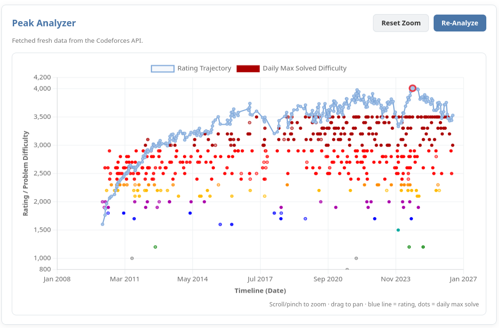

# Codeforces Peak Analyzer

A browser extension for Codeforces profile pages. It overlays your rating
trajectory (with your peak rating highlighted) against a scatter of the
hardest problem you solved each day, so you can see how your solving
difficulty tracked your rating over time.

- Pan by dragging, zoom with scroll/pinch, reset with one click
- Results are cached locally for 10 minutes so repeat visits don't hammer
  the Codeforces API
- Works on Firefox and Chrome (Manifest V3)

## Installation
### Firefox
You can grab the extension direclty from [here](https://addons.mozilla.org/en-US/firefox/addon/codeforces-peak-analyzer/).  
 
#### Development:

1. Go to `about:debugging#/runtime/this-firefox`.
2. Click **Load Temporary Add-on…** and select the `manifest.json`.
3. Visit any `codeforces.com/profile/<handle>` page — you'll see a new
   "Peak Analyzer" panel.

> This is temporary and will be removed after restart.

### Chrome

1. Download `cf-peak-analyzer-chrome.zip` from [github-releases]([/releases](https://github.com/MysteriousBits/peak-analyzer/releases/tag/v1.0)) and unzip it.
2. Go to `chrome://extensions`.
3. Turn on **Developer mode** (top right).
4. Click **Load unpacked** and select the unzipped folder.
5. Visit any `codeforces.com/profile/<handle>` page.

> Unlike Firefox's temporary add-ons, this stays installed across
> restarts.
